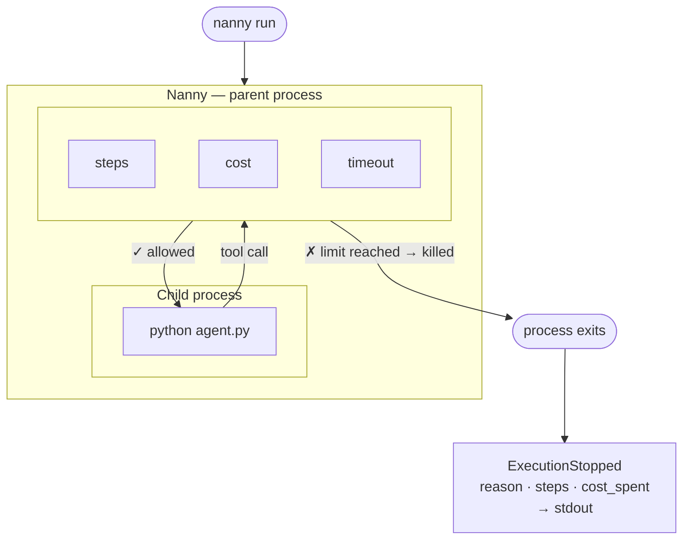

<p align="center">
  <picture>
    <source media="(prefers-color-scheme: dark)" srcset="https://raw.githubusercontent.com/nanny-run/nanny/main/assets/nanny-logo-dark.svg" />
    <source media="(prefers-color-scheme: light)" srcset="https://raw.githubusercontent.com/nanny-run/nanny/main/assets/nanny-logo-light.svg" />
    
  </picture>
</p>

<p align="center">
  <strong>Open-source execution boundary for autonomous systems.</strong><br/>
  Hard limits. Deterministic stops. Structured audit trail.
</p>

<p align="center">
  <a href="LICENSE"></a>
  <a href="https://crates.io/crates/nannyd"></a>
  <a href="https://pypi.org/project/nanny-sdk/"></a>
  <a href="https://github.com/nanny-run/nanny/releases"></a>
  <a href="https://github.com/nanny-run/nanny/actions/workflows/ci-rust.yml"></a>
  <a href="https://github.com/nanny-run/nanny/pulls"></a>
</p>

<p align="center">
  <a href="https://docs.nanny.run">Documentation</a> ·
  <a href="https://docs.nanny.run/v0.2/quickstart">Quickstart</a> ·
  <a href="CHANGELOG.md">Changelog</a> ·
  <a href="https://github.com/nanny-run/nanny/issues">Report a Bug</a> ·
  <a href="CONTRIBUTING.md">Contributing</a>
</p>

---

## What is Nanny?

You deploy a multi-agent system on Friday. Monday morning your CFO sends a Slack: "Why did we spend $4,000 over the weekend?" One agent got stuck in a loop. Nobody stopped it. No audit trail. Nothing.

This is happening right now at hundreds of companies.

Nanny is the execution boundary that prevents it.

You tell Nanny what each agent is allowed to do — how many steps, how much budget, which tools, how long. The moment any limit is crossed, Nanny kills the process immediately, emits a structured log saying exactly what happened and why, and exits. No grace period. No recovery logic. No second chances.

When you have multiple specialized agents — a researcher, an analyst, a reporter — Nanny gives each one its own budget, its own tool allowlist, and its own kill switch. The analysis agent cannot call the reporter's tools. A loop-detection rule stops any agent from running the same computation five times in a row. The moment any agent steps outside its role or hits its ceiling, it stops. You get a full audit trail of every call, every decision, and every stop reason.

Think of it as a **hard execution boundary** — deterministic, auditable, and structurally impossible for any agent to bypass.



---

## The Nanny ecosystem

| Layer                           | What it does                                                                                                                             |
| ------------------------------- | ---------------------------------------------------------------------------------------------------------------------------------------- |
| **Nanny CLI**                   | Hard timeout, step, and cost limits for any agent process in any language.                                                               |
| **Rust SDK**                    | Per-function cost metering, allowlist enforcement, and custom rules — in-process.                                                        |
| **Python SDK**                  | Per-function and per-role governance for Python agents — each agent in your fleet gets its own budget, tool allowlist, and custom rules. |
| **Governance server**           | Cross-process and cross-machine enforcement via a long-lived server with mutual TLS.                                                     |
| **Nanny Cloud** _(Coming soon)_ | Durable audit logs, team dashboards, org-level budget aggregation, and managed fleet enforcement.                                        |

→ Full docs at [docs.nanny.run](https://docs.nanny.run)

---

## Sample applications

Four complete agent samples ship in `examples/`. Three use [Groq](https://console.groq.com) (`llama-3.3-70b-versatile`, free tier — no credit card required); `metrics_crew` uses OpenAI (`gpt-4.1-nano`). Copy `.env.example` → `.env` in each example directory and add the relevant API key.

| Sample                                                         | What it does                                                                                                                                                                                                                                                                                                 | Stop reasons demonstrated                     |
| -------------------------------------------------------------- | ------------------------------------------------------------------------------------------------------------------------------------------------------------------------------------------------------------------------------------------------------------------------------------------------------------ | --------------------------------------------- |
| [`examples/rust/webdingo`](examples/rust/webdingo)             | Web research agent (Rust) — fetches pages, synthesises a report. Classic spiral risk.                                                                                                                                                                                                                        | `BudgetExhausted`, `RuleDenied`               |
| [`examples/rust/qabud`](examples/rust/qabud)                   | Code review agent (Rust) — reads source files, identifies issues, blocks sensitive files before they're opened.                                                                                                                                                                                              | `RuleDenied`, `ToolDenied`, `MaxStepsReached` |
| [`examples/python/dev_assist`](examples/python/dev_assist)     | Debug agent (LangGraph) — given a stack trace, reads relevant files and searches for related symbols. Python drives every tool call; LLM only synthesises the diagnosis.                                                                                                                                     | `BudgetExhausted`, `RuleDenied`, `ToolDenied` |
| [`examples/python/metrics_crew`](examples/python/metrics_crew) | Multi-agent governance (CrewAI) — four specialized agents with per-role budgets, per-role tool allowlists, and a loop-detection rule. The analysis agent cannot call the reporter's tools. If it tries, `ToolDenied` fires. This is what least-privilege fleet governance looks like in 200 lines of Python. | `BudgetExhausted`, `RuleDenied`, `ToolDenied` |

```bash
# Rust examples
cd examples/rust/webdingo && nanny run -- "best Rust HTTP clients"
cd examples/rust/qabud && nanny run -- ./src

# Python examples
cd examples/python/dev_assist && nanny run
cd examples/python/metrics_crew && nanny run
```

> **Scope:** Nanny governs agents within a single process today. When all agents run in the same process — as in CrewAI, LangGraph, AutoGen, or any framework that orchestrates agents within one Python or Rust runtime — every agent is governed. For cross-process and cross-machine enforcement, use the governance server.

---

## Install

The Nanny CLI is a **system tool** — install it once globally and use `nanny run` from any project that has a `nanny.toml`.

**macOS**

```sh
brew tap nanny-run/nanny
brew install nannyd
```

**Linux**

```sh
curl -fsSL https://install.nanny.run | sh
```

Have Rust installed? `cargo install nannyd` also works.

**Windows**

```powershell
irm https://install.nanny.run/windows | iex
```

Installs to `%LOCALAPPDATA%\nanny\` and adds to PATH. Restart your terminal after installing.

Or download a pre-built binary directly from [GitHub Releases](https://github.com/nanny-run/nanny/releases).

---

## SDK installation

SDKs are **project dependencies** — add them per project, not globally.

**Rust**

```sh
cargo add nannyd
```

**Python**

```sh
pip install nanny-sdk
```

---

## 60-second quickstart

```sh
# 1. Scaffold a nanny.toml in your project root
nanny init

# 2. Run your agent
nanny run

# 3. Use a named limit set for specific workloads
nanny run --limits=researcher
```

**nanny.toml:**

```toml
[runtime]
mode = "local"

[start]
cmd = "python agent.py"   # nanny run always reads this

[limits]
steps   = 100     # max tool calls
cost    = 1000    # max cost units
timeout = 30000   # wall-clock ms

[limits.researcher]
steps   = 200
cost    = 5000
timeout = 120000

[tools]
allowed = ["http_get", "read_file"]   # anything not listed is denied
```


---

## Rust SDK — all three macros

For Rust agents, annotate functions directly to get per-function cost accounting,
allowlist enforcement, and custom policy rules:

```rust
use nannyd::{tool, rule, agent, PolicyContext};

/// Each call charges 10 cost units and requires the tool to be in the allowlist.
#[nanny::tool(cost = 10)]
fn search_web(query: String) -> String {
    // ... HTTP request ...
    String::new()
}

/// Return false to stop the agent immediately with RuleDenied.
#[nanny::rule("no_spiral")]
fn check_spiral(ctx: &PolicyContext) -> bool {
    let h = &ctx.tool_call_history;
    // Stop if the last 3 calls were all search_web
    !(h.len() >= 3 && h.iter().rev().take(3).all(|t| t == "search_web"))
}

/// Activates [limits.researcher] for the duration of this function.
/// Limits revert automatically on return, even if the function panics.
#[nanny::agent("researcher")]
async fn run_research(topic: &str) {
    // ... agent loop — search_web governed by nanny ...
}
```

All macros are no-ops when running outside `nanny run` — no enforcement overhead.


→ Full Rust SDK guide at [docs.nanny.run/v0.2/guides/rust-sdk](https://docs.nanny.run/v0.2/guides/rust-sdk)

---

## Python SDK — all three decorators

For Python agents, the same model as the Rust SDK — as decorators:

```python
from nanny_sdk import tool, rule, agent

@tool(cost=10)
def search_web(query: str) -> str:
    import httpx
    return httpx.get(f"https://en.wikipedia.org/wiki/{query}").text

@rule("no_spiral")
def check_spiral(ctx) -> bool:
    h = ctx.tool_call_history
    return not (len(h) >= 3 and len(set(h[-3:])) == 1)

@agent("researcher")
def run_research(topic: str) -> list[str]:
    # Runs under [limits.researcher] from nanny.toml
    return [search_web(topic)]
```

Works with any framework — LangGraph, CrewAI, LangChain, plain Python. In Python-driven pipelines (LangGraph nodes, plain Python loops, CrewAI tasks), use `@nanny_tool` alone — your code calls the function directly and Nanny intercepts every call:

```python
from nanny_sdk import tool as nanny_tool

@nanny_tool(cost=5)
def read_file(path: str) -> str:
    with open(path) as f:
        return f.read()
```

When a framework uses its own decorator for tool registration (e.g. LangChain's `@tool`), stack it outside `@nanny_tool` so the framework sees its own wrapper and Nanny intercepts the inner call:

```python
from langchain_core.tools import tool as lc_tool
from nanny_sdk import tool as nanny_tool

@lc_tool                   # outer — LangChain registers this for LLM dispatch
@nanny_tool(cost=5)        # inner — Nanny intercepts before the function body runs
def read_file(path: str) -> str:
    with open(path) as f:
        return f.read()
```

All decorators are no-ops when running outside `nanny run` — zero overhead in development and CI.

→ Full Python SDK guide at [docs.nanny.run/v0.2/guides/python-sdk](https://docs.nanny.run/v0.2/guides/python-sdk)

---

## Event log

Every run emits NDJSON to stdout. One event per line. Always starts with `ExecutionStarted`, always ends with `ExecutionStopped`.

```json
{"event":"ExecutionStarted","ts":1711234567000,"limits":{"steps":100,"cost":1000,"timeout":30000},"limits_set":"[limits]","command":"python agent.py"}
{"event":"ToolAllowed","ts":1711234567120,"tool":"http_get"}
{"event":"StepCompleted","ts":1711234567800,"step":1}
{"event":"ExecutionStopped","ts":1711234572000,"reason":"BudgetExhausted","steps":12,"cost_spent":1000,"elapsed_ms":5000}
```

Pipe it to a file, stream it to your log aggregator, or query it inline:

```sh
nanny run > nanny.log
nanny run | tee nanny.log
```

---

## Documentation

Full reference at **[docs.nanny.run](https://docs.nanny.run)** — quickstart, concepts, CLI reference, `nanny.toml` schema, event log, Rust SDK guide, and Python SDK guide.

---

## Contributing

See [CONTRIBUTING.md](CONTRIBUTING.md).

---

## License

Apache-2.0 — see [LICENSE](LICENSE).
