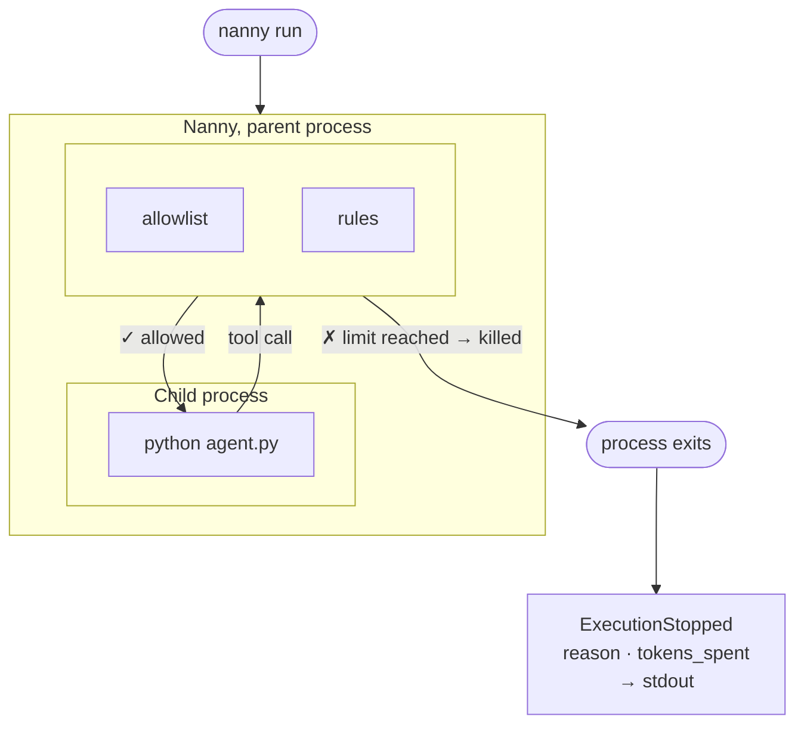

<p align="center">
  <picture>
    <source media="(prefers-color-scheme: dark)" srcset="https://raw.githubusercontent.com/nanny-run/nanny/main/assets/nanny-logo-dark.svg" />
    <source media="(prefers-color-scheme: light)" srcset="https://raw.githubusercontent.com/nanny-run/nanny/main/assets/nanny-logo-light.svg" />
    
  </picture>
</p>

<p align="center">
  <strong>Open-source authorization and audit layer for AI agents that take real-world actions.</strong><br/>
  Bounded authority. Deterministic stops. Provable audit trail.
</p>

<p align="center">
  <a href="LICENSE"></a>
  <a href="https://crates.io/crates/nannyd"></a>
  <a href="https://pypi.org/project/nanny-sdk/"></a>
  <a href="https://github.com/nanny-run/nanny/releases"></a>
  <a href="https://github.com/nanny-run/nanny/actions/workflows/ci-rust.yml"></a>
  <a href="https://github.com/nanny-run/nanny/pulls"></a>
</p>

<p align="center">
  <a href="https://docs.nanny.run">Documentation</a> ·
  <a href="https://docs.nanny.run/quickstart">Quickstart</a> ·
  <a href="CHANGELOG.md">Changelog</a> ·
  <a href="https://github.com/nanny-run/nanny/issues">Report a Bug</a> ·
  <a href="CONTRIBUTING.md">Contributing</a>
</p>

---

## What is Nanny?

You deploy a multi-agent system on Friday. Monday morning your CFO sends a Slack: "Why did we spend $4,000 over the weekend?" One agent got stuck in a loop. Nobody stopped it. No audit trail. Nothing.

This is happening right now at hundreds of companies.

Nanny is the enforcement layer that prevents it.

You tell Nanny what each agent is allowed to do: which tools it may call, and under which rules. The moment it tries something outside that, Nanny stops the run immediately, emits a structured log saying exactly what happened and why, and exits. No grace period. No recovery logic. No second chances.

Liability attaches to authority, not consumption. Nobody is accountable for a token count. People are accountable when an agent emails the wrong customer, deletes the wrong record, or moves money it should not have.

Rules read **labels**, not tool names, so one rule governs any application whose operator has labelled their tools. `no_send_after_read` denies an `external_effect` call once a `reads_untrusted` call has happened in the same run: the shape of an indirect prompt injection, caught without Nanny ever reading the content.

Think of it as a **deterministic enforcement layer**, auditable, and structurally impossible for any agent to bypass.


```mermaid
flowchart TD
    CMD(["nanny run"])
    CMD --> NANNY

    subgraph NANNY["Nanny, parent process"]
        direction LR

        subgraph CHILD["Child process"]
            AGENT["python agent.py"]
        end

        subgraph ENFORCE[" "]
            direction TB
            ALLOW["allowlist"]
            RULES["rules"]
        end

        AGENT -- "tool call" --> ENFORCE
        ENFORCE -- "✓  allowed" --> AGENT
    end

    ENFORCE -- "✗  limit reached → killed" --> DEAD(["process exits"])
    DEAD --> LOG["ExecutionStopped\nreason · tokens_spent\n→ stdout"]
```

---

## The Nanny ecosystem

| Layer                           | What it does                                                                                                                             |
| ------------------------------- | ---------------------------------------------------------------------------------------------------------------------------------------- |
| **Nanny CLI**                   | Tool permission and rule enforcement for any agent process in any language.                                                              |
| **Rust SDK**                    | Per-function token metering, allowlist enforcement, and custom rules, in-process.                                                       |
| **Python SDK**                  | Per-function governance for Python agents: tools, rules, and named phases.                                                               |
| **Governance server**           | Cross-process and cross-machine enforcement via a long-lived server with mutual TLS.                                                     |
| **Nanny Cloud**                 | Durable signed audit trails, cost attribution across your fleet, and team access control.                                                |

→ Full docs at [docs.nanny.run](https://docs.nanny.run)

---

## Rule packs

Curated rules, installed with one command and pinned to a version:

```sh
nanny rules add nanny:recommended@1.0.0 --from ./packs/nanny-recommended
```

| Pack | Rules | Covers |
| --- | --- | --- |
| `nanny:recommended` | 14 | Injection and taint, sequence, loops, argument safety, destructive actions, payments |
| `nanny:owasp` | 10 | Controls mapped to the OWASP Agentic Top Ten |

Your source is never edited. `@rule` stays for your own private rules.

> **Scope:** Nanny governs agents within a single process today. When all agents run in the same process, as in CrewAI, LangGraph, AutoGen, or any framework that orchestrates within one Python or Rust runtime, every agent is governed. For cross-process and cross-machine enforcement, use the governance server.

---

## Install

The Nanny CLI is a **system tool**, install it once globally and use `nanny run` from any project that has a `nanny.toml`.

**macOS**

```sh
brew tap nanny-run/nanny
brew install nannyd
```

**Linux**

```sh
curl -fsSL https://install.nanny.run | sh
```

Have Rust installed? `cargo install nannyd` also works.

**Windows**

```powershell
irm https://install.nanny.run/windows | iex
```

Installs to `%LOCALAPPDATA%\nanny\` and adds to PATH. Restart your terminal after installing.

Or download a pre-built binary directly from [GitHub Releases](https://github.com/nanny-run/nanny/releases).

---

## SDK installation

SDKs are **project dependencies**, add them per project, not globally.

**Rust**

```sh
cargo add nannyd
```

**Python**

```sh
pip install nanny-sdk
```

---

## 60-second quickstart

```sh
# 1. Scaffold a nanny.toml (and a permanent .nanny/app.json identity) in your project root
nanny init

# 2. Run your agent
nanny run

# 3. Or run a governance server for several processes
nanny run --serve
```

**nanny.toml:**

```toml
[start]
cmd = "python agent.py"   # nanny run always reads this

[tools]
allowed = ["web_search", "send_outreach"]   # anything not listed is denied

[tools.web_search]
max_calls       = 30
reads_untrusted = true    # ingests content you do not control

[tools.send_outreach]
external_effect = true    # acts on the outside world

[rules]
extends = ["nanny:recommended@1.0.0"]
```

---

## Rust SDK: all three macros

For Rust agents, annotate functions directly to get per-function token accounting,
allowlist enforcement, and custom policy rules:

```rust
use nannyd::{tool, rule, agent, PolicyContext};

/// Each call charges 10 tokens and requires the tool to be in the allowlist.
#[nanny::tool(tokens = 10)]
fn search_web(query: String) -> String {
    // ... HTTP request ...
    String::new()
}

/// Return false to stop the agent immediately with RuleDenied.
#[nanny::rule("no_spiral")]
fn check_spiral(ctx: &PolicyContext) -> bool {
    let h = &ctx.tool_call_history;
    // Stop if the last 3 calls were all search_web
    !(h.len() >= 3 && h.iter().rev().take(3).all(|t| t == "search_web"))
}

/// Activates [limits.researcher] for the duration of this function.
/// Limits revert automatically on return, even if the function panics.
#[nanny::agent("researcher")]
async fn run_research(topic: &str) {
    // ... agent loop, search_web governed by nanny ...
}
```

All macros are no-ops when running outside `nanny run`, no enforcement overhead.

→ Full Rust SDK guide at [docs.nanny.run/guides/rust-sdk](https://docs.nanny.run/guides/rust-sdk)

---

## Python SDK: all three decorators

For Python agents, the same model as the Rust SDK, as decorators:

```python
from nanny_sdk import tool, rule, agent

@tool(tokens=10)
def search_web(query: str) -> str:
    import httpx
    return httpx.get(f"https://en.wikipedia.org/wiki/{query}").text

@rule("no_spiral")
def check_spiral(ctx) -> bool:
    h = ctx.tool_call_history
    return not (len(h) >= 3 and len(set(h[-3:])) == 1)

@agent("researcher")
def run_research(topic: str) -> list[str]:
    # Runs under [limits.researcher] from nanny.toml
    return [search_web(topic)]
```

Works with any framework, LangGraph, CrewAI, LangChain, plain Python. In Python-driven pipelines (LangGraph nodes, plain Python loops, CrewAI tasks), use `@nanny_tool` alone, your code calls the function directly and Nanny intercepts every call:

```python
from nanny_sdk import tool as nanny_tool

@nanny_tool(tokens=5)
def read_file(path: str) -> str:
    with open(path) as f:
        return f.read()
```

When a framework uses its own decorator for tool registration (e.g. LangChain's `@tool`), stack it outside `@nanny_tool` so the framework sees its own wrapper and Nanny intercepts the inner call:

```python
from langchain_core.tools import tool as lc_tool
from nanny_sdk import tool as nanny_tool

@lc_tool                   # outer: LangChain registers this for LLM dispatch
@nanny_tool(tokens=5)      # inner: Nanny intercepts before the function body runs
def read_file(path: str) -> str:
    with open(path) as f:
        return f.read()
```

All decorators are no-ops when running outside `nanny run`, zero overhead in development and CI.

**LLM token tracking:** call `nanny_sdk.instrument(client)` once at startup to have Nanny measure LLM token usage. Measurement only, nothing is enforced from it. Works with OpenAI, Groq, Together AI, Azure OpenAI, LiteLLM, Anthropic, Mistral, Google Gemini, and Cohere v2:

```python
import nanny_sdk, openai
client = openai.OpenAI()
nanny_sdk.instrument(client)   # one line, done
```

For Rust agents, report usage explicitly after each LLM call, Rust can't patch a client at runtime:

```rust
use nanny::{report_usage, Usage};
report_usage(Usage { input: resp.usage.prompt_tokens, output: resp.usage.completion_tokens, ..Default::default() });
```

→ Full Python SDK guide at [docs.nanny.run/guides/python-sdk](https://docs.nanny.run/guides/python-sdk)

---

## Event log

Every run emits NDJSON to stdout. One event per line. Always starts with `ExecutionStarted`, always ends with `ExecutionStopped`.

```json
{"event":"ExecutionStarted","ts":1711234567000,"run_id":"a1b2c3d4","seq":0,"command":"python agent.py","allowed_tools":["web_search","send_outreach"],"tool_labels":{"web_search":["reads_untrusted"],"send_outreach":["external_effect"]},"config_hash":"9f2a41c8"}
{"event":"RulesDeclared","ts":1711234567100,"run_id":"a1b2c3d4","seq":1,"rules":[{"name":"no_send_after_read","version":"1.0.0","pack":"nanny:recommended"}]}
{"event":"ToolAllowed","ts":1711234567120,"run_id":"a1b2c3d4","seq":2,"tool":"web_search","cleared_by":["no_send_after_read"]}
{"event":"RuleDenied","ts":1711234572000,"run_id":"a1b2c3d4","seq":3,"tool":"send_outreach","rule_name":"no_send_after_read","cleared_by":[]}
{"event":"ExecutionStopped","ts":1711234572000,"run_id":"a1b2c3d4","seq":4,"reason":"RuleDenied","tokens_spent":380,"elapsed_ms":5000}
```

Pipe it to a file, stream it to your log aggregator, or query it inline:

```sh
nanny run > nanny.log
nanny run | tee nanny.log
```

---

## Documentation

Full reference at **[docs.nanny.run](https://docs.nanny.run)**, quickstart, concepts, CLI reference, `nanny.toml` schema, event log, Rust SDK guide, and Python SDK guide.

---

## Contributing

See [CONTRIBUTING.md](CONTRIBUTING.md).

---

## License

Apache-2.0, see [LICENSE](LICENSE).
