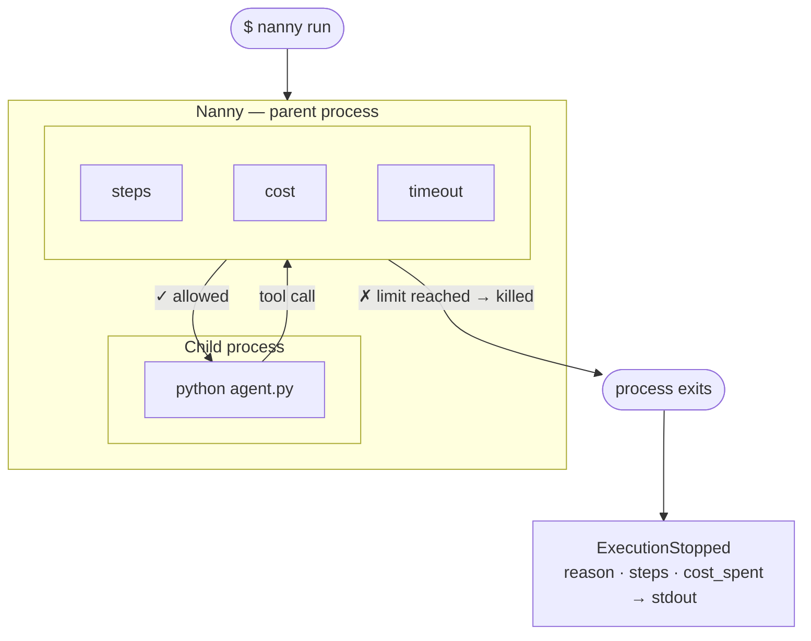

## The execution boundary

When you run `nanny run`, Nanny becomes the parent process of your agent.
It reads `[start].cmd` from `nanny.toml`, spawns it as a child, and owns the process lifecycle — it decides when the process lives and when it dies.



The moment any limit is crossed, Nanny kills the child process immediately — the process cannot catch, delay, or prevent the stop. An `ExecutionStopped` event is emitted with the reason, and Nanny exits with a non-zero status code.

## What Nanny enforces

All three limits are enforced on every run:

| Limit | Requirement | Behaviour |
|-------|------------|----------|
| `timeout` | None — works for any process | Killed when wall-clock time exceeds the configured value |
| `steps` | Rust SDK or Python SDK | Killed when step count reaches the configured limit |
| `cost` | Rust SDK or Python SDK | Killed when accumulated cost reaches the configured budget |

Timeout enforcement requires no code changes and works for any process in any language.
Step and cost enforcement require the agent to report tool calls — either via the [Rust SDK](/guides/rust-sdk) macros or the Python SDK decorators.

## Passthrough mode

When running outside `nanny run`, every macro and decorator becomes a no-op:

```python
@tool(cost=10)
def search(query: str) -> str:
    ...  # runs normally, no enforcement
```

This means you can ship instrumented code and run it in development, CI, and production without nanny — until you explicitly wrap it with `nanny run`. The behaviour is identical either way.
