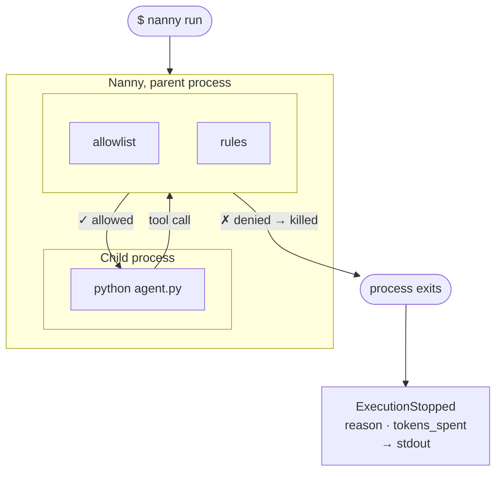
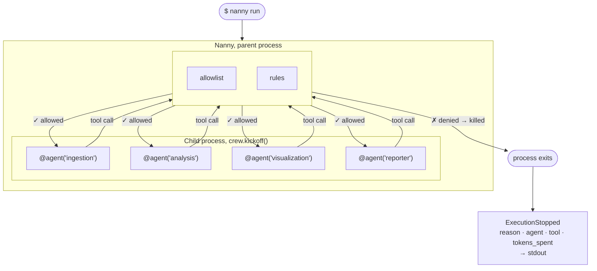

## The enforcement model

When you run `nanny run`, Nanny becomes the parent process of your agent.
It reads `[start].cmd` from `nanny.toml`, spawns it as a child, and owns the process lifecycle. Every tool call the agent makes is evaluated before it happens.



Two checks, in order. The allowlist runs first: a tool that is not in
`[tools] allowed` is denied before any rule sees it. Then your rules run, in
registration order, and the first one to refuse ends the evaluation.

A denial kills the child process immediately. The process cannot catch, delay,
or prevent the stop. An `ExecutionStopped` event is emitted with the reason, and
Nanny exits non-zero.

## Multi-agent governance

When multiple agents run in the same process, as in CrewAI, LangGraph, AutoGen, or any framework that orchestrates agents within a single Python or Rust runtime, the enforcement model above applies to all of them simultaneously. A single `nanny run` governs the entire fleet.



`@agent("role")` names which phase of the run the events that follow belong to,
so every verdict in the log can be attributed to the agent that produced it.
Tool calls from every agent flow through the same allowlist and the same rules:
one `nanny run` governs the whole fleet.

For cross-process and cross-machine enforcement, use the [governance server](/v0.6/guides/governance-server).

---

## What Nanny enforces

Two things, and both are about authority:

| Check | Declared in | Behaviour |
| --- | --- | --- |
| Tool permission | `[tools] allowed` in `nanny.toml` | A call to an undeclared tool fires `ToolDenied` and ends the run |
| Rules | `@rule` in your code, or an installed [rule pack](/v0.6/guides/rule-packs) | The first rule to refuse fires `RuleDenied` and ends the run |

Both require the agent to report its tool calls, through the
[Rust SDK](/v0.6/guides/rust-sdk) macros or the [Python SDK](/v0.6/guides/python-sdk)
decorators.

Tokens are **measured, never enforced**. They are recorded for attribution, so
you can answer what a run cost, and no ceiling stops a run for spending them.
Liability attaches to what an agent was allowed to do, not to how much it
used.

## Passthrough mode

When running outside `nanny run`, every macro becomes a no-op:

```rust
#[tool(tokens = 10)]
fn search(query: &str) -> String {
    // runs normally, no enforcement
}
```

This means you can ship instrumented code and run it in development, CI, and production without Nanny, until you explicitly wrap it with `nanny run`. The behaviour is identical either way.
